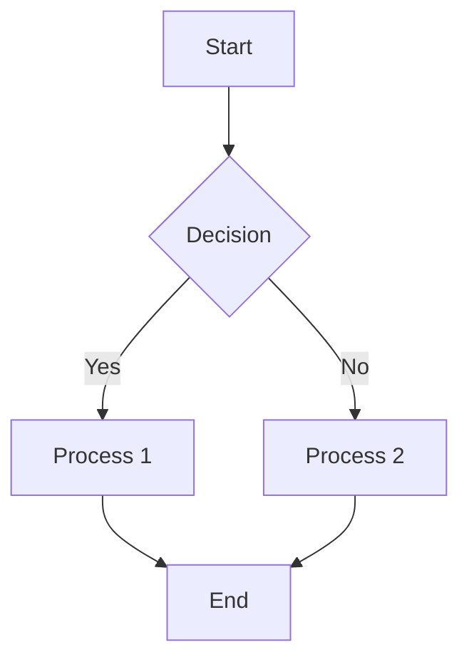

# MDZ Format Specification

## Overview

The MDZ format (`.mdz`) is a compressed Markdown document bundle that includes the main Markdown document, metadata, and associated assets (images, diagrams, etc.) in a single file. It uses Zstandard (zstd) compression for efficient storage and fast decompression.

## Features

- **GitHub Flavored Markdown**: Full support for GFM syntax including tables, task lists, and fenced code blocks.
- **YAML Front Matter**: Metadata can be included in YAML format at the beginning of the document.
- **Mermaid Diagrams**: Embedded Mermaid diagrams are supported and can be pre-rendered to SVG.
- **SVG Embedding**: SVG images can be embedded directly in the document.
- **LaTeX Math**: Mathematical expressions using LaTeX syntax are supported via MathJax or KaTeX.
- **Asset Bundling**: All referenced assets (images, diagrams, etc.) are bundled with the document.

## Bundle Structure

```
document.mdz
├── index.md (Main Markdown document)
├── metadata.yaml (Optional YAML metadata)
├── mermaid/
│   └── *.mmd, *.svg (Mermaid diagram files)
├── images/
│   └── *.svg, *.png, *.jpg (Image files)
└── additional_assets/
    └── (any additional files)
```

## Technical Details

### Compression

The MDZ format uses Zstandard (zstd) compression, which provides:
- High compression ratios
- Fast decompression speeds
- Configurable compression levels (1-22)

### File Format

1. The bundle is first created as a TAR archive containing all files and directories.
2. The TAR archive is then compressed using Zstandard.
3. The compressed data is saved with the `.mdz` extension.

### Metadata

Metadata can be included in two ways:
1. As YAML front matter at the beginning of the main Markdown document.
2. As a separate `metadata.yaml` file in the bundle.

Example YAML front matter:
```yaml
---
title: "Example Document"
author: "Author Name"
date: "2025-05-01"
tags: ["markdown", "documentation"]
---
```

## Usage Examples

### Basic Markdown

```markdown
# Example Title

This is a paragraph with **bold** and *italic* text.

## Subheading

- List item 1
- List item 2
- List item 3

1. Numbered item 1
2. Numbered item 2
3. Numbered item 3
```

### Task Lists

```markdown
## Todo List

- [x] Completed task
- [ ] Incomplete task
- [ ] Another incomplete task
```

### Tables

```markdown
## Data Table

| Name  | Age | Occupation |
|-------|-----|------------|
| Alice | 28  | Engineer   |
| Bob   | 35  | Designer   |
| Carol | 42  | Manager    |
```

### Mermaid Diagrams

```markdown
## Workflow Diagram


```

### LaTeX Math

```markdown
## Mathematical Expressions

Inline math: $E = mc^2$

Display math:

$$
\frac{d}{dx}(x^n) = nx^{n-1}
$$
```

### Image Embedding

```markdown
## Images


```

## Command-Line Tools

The MDZ format comes with command-line tools for creating and extracting MDZ bundles:

```bash
# Create an MDZ bundle from a Markdown file
python mdz_bundle.py create document.md document.mdz

# Extract an MDZ bundle to a Markdown file
python mdz_bundle.py extract document.mdz document.md
```

## API Reference

### Python API

```python
from mdz_bundle import MDZBundle, create_mdz_from_markdown_file, extract_mdz_to_markdown

# Create an MDZ bundle
bundle = MDZBundle()
bundle.create_from_markdown("# Hello World", {"title": "Example"})
bundle.add_file("image.png", image_data)
bundle.save("document.mdz")

# Load an MDZ bundle
bundle = MDZBundle()
bundle.load("document.mdz")
content = bundle.get_main_content()
metadata = bundle.get_metadata()

# Extract an MDZ bundle
extract_mdz_to_markdown("document.mdz", "document.md")

# Create an MDZ bundle from a file
create_mdz_from_markdown_file("document.md", "document.mdz")
```

## Editor Integration

The MDZ format can be integrated with various editors:

- **Visual Studio Code**: Using a custom extension for MDZ support.
- **Obsidian**: Using a plugin for MDZ support.
- **Typora**: Using external scripts for MDZ integration.

See the [MDZ_EDITOR_INTEGRATION.md](MDZ_EDITOR_INTEGRATION.md) file for detailed integration instructions.

## Export Support

The MDZ format supports exporting to various formats:

- **PDF**: Using XeLaTeX, WeasyPrint, or wkhtmltopdf.
- **HTML**: With full support for Mermaid diagrams and LaTeX math.
- **EPUB**: For e-book readers.
- **DOCX**: For Microsoft Word compatibility.

## Compatibility

The MDZ format is designed to be compatible with:

- **Operating Systems**: Windows, macOS, Linux
- **Editors**: VS Code, Obsidian, Typora, and any editor that supports Markdown
- **Browsers**: Chrome, Firefox, Safari, Edge

## Dependencies

- **Python 3.6+**
- **zstandard**: For compression/decompression
- **markdown**: For Markdown parsing
- **pyyaml**: For YAML parsing
- **pymdown-extensions** (optional): For GitHub Flavored Markdown support

## License

The MDZ format and associated tools are released under the MIT License.
