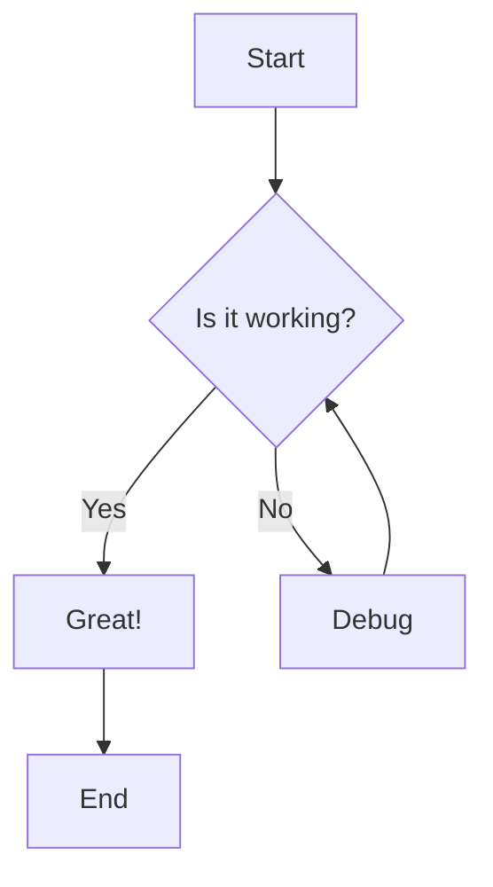
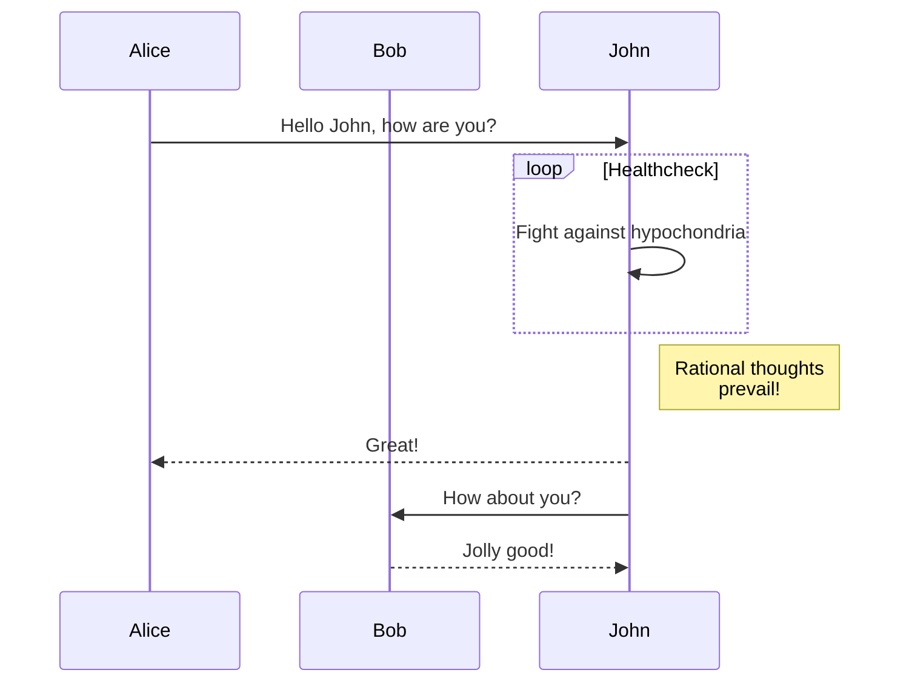
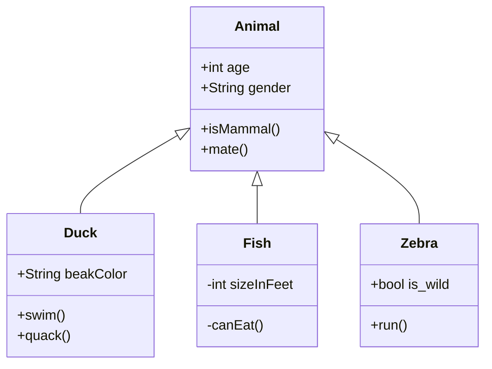
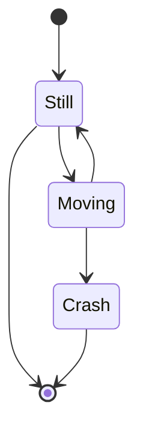
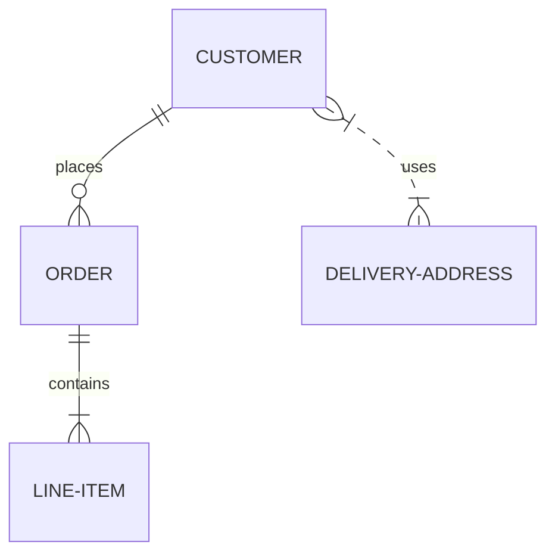
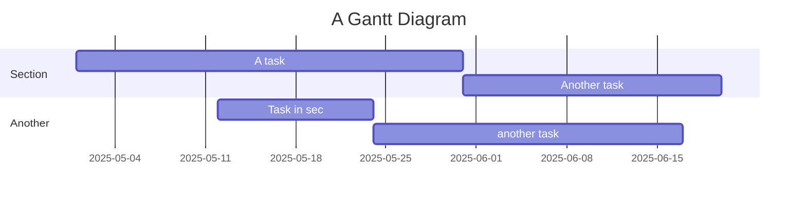
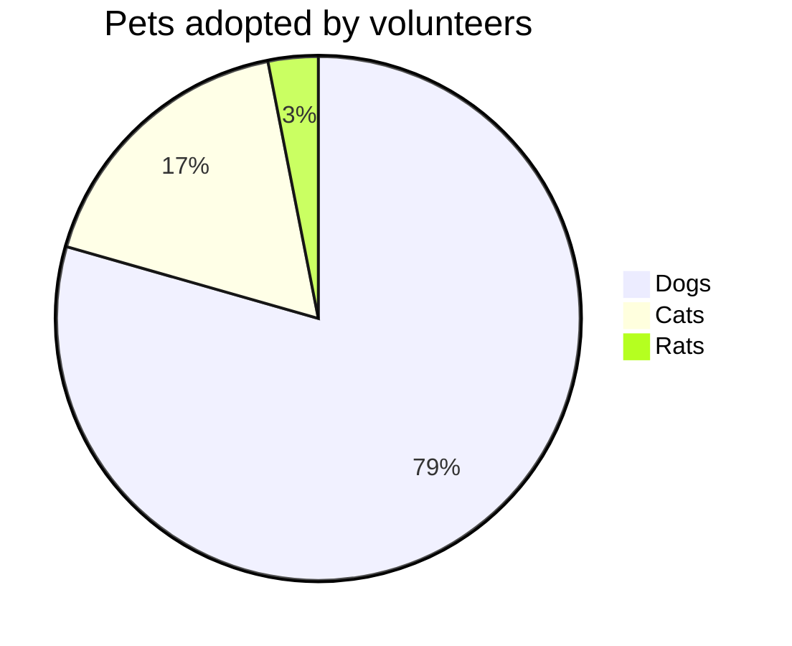

# Mermaid Diagrams Test

This file tests Mermaid diagram rendering.

## Flowchart

## Sequence Diagram

## Class Diagram

## State Diagram

## Entity Relationship Diagram

## Gantt Chart

## Pie Chart

