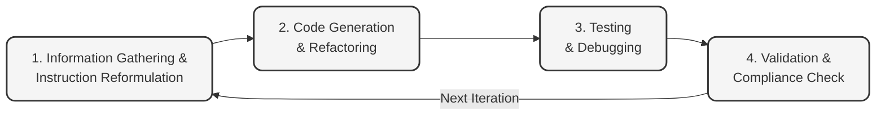

# LLM-First Development Quickstart Guide

## Overview
This guide provides a systematic approach to building software applications using an LLM-first workflow. This method is approximately 5x faster than traditional LLM-assisted development approaches, optimizing the entire development lifecycle.

## Prerequisites and Setup

### Project Scope
- This workflow is optimized for projects up to approximately 30,000 lines of code
- Team members are expected to manage projects of this size, including dozens of features
- Complete documentation production is required (project description, implementation plan, readme.md, etc.)
- Basic LLM understanding and previous experience is assumed

### Required Accounts and Tools
- Paid Claude account (Team or Pro)
- Development environment with necessary compilers/interpreters
- Version control system

### Browser Setup (Three-Browser Approach)
1. **Primary Browser**: Claude for code and document generation
2. **Secondary Browser**: Additional LLM (second Claude instance or ChatGPT) for concept clarification and filling knowledge gaps
3. **Tertiary Browser**: Mermaid diagram renderer (mermaid.live or similar) for visualizing workflows and architecture

### Project Organization
1. **Initial Documentation Phase**:
   - Create project documentation in a normal conversation
   - Develop project description, technical implementation plan, compliance documents, and style guides
   
2. **Project Setup**:
   - Start a formal project with detailed instructions based on initial documentation
   - Establish directory structure and configuration files
   
3. **Project Flattening (Script-Driven)**:
   - Use Claude to generate a flattening script in your preferred language
   - The script should copy files to a separate directory with directory structure in filenames
   - Use double-dash separator format (e.g., `src--utils--helper.js`)
   - Configure script to exclude specific directories or files as needed
   - Script should clear and re-flatten on subsequent iterations automatically

## Basic Workflow Model



## Detailed Workflow Steps

### 1. Information Gathering (Entry Activity)

**Required Inputs:**
- Style guide documentation
- Regulatory/compliance documents
- Project owner special instructions
- Previous examples of desired coding structure
- Comprehensive list of features to be implemented
- Marketing requirements and user experience guidelines
- Technical requirements and constraints

**Process:**
- Define project requirements and scope
- Research appropriate technologies and frameworks
- Collect all necessary reference materials
- Establish project boundaries and constraints

**Outputs:**
- Comprehensive project description
- Technical specifications document
- Initial architecture design
- Feature priority list

### 2. Instruction Reformulation (Loop Start)

**Required Inputs:**
- Project description and technical specifications
- Console output from previous iteration (iteration 2+)
- Error logs from previous testing phase (iteration 2+)
- Feedback from team members
- Specific issues to address

**Process:**
- **For first iteration:**
  - Create clear, detailed instructions for the LLM
  - Structure prompts to generate initial code framework
  
- **For subsequent iterations:**
  - Review testing output from previous iteration
  - Identify issues and areas for improvement
  - Reformulate instructions based on feedback
  - Be specific about what needs to be fixed or enhanced

**Outputs:**
- Structured LLM prompts
- Documented code requirements
- Prioritized task list for current iteration

### 2. Code Generation & Refactoring

**Required Inputs:**
- Technical requirements document
- AI prompts from Step 1
- Code from previous iterations (iteration 2+)
- Feedback on code structure and organization
- Identified bugs or issues to address
- Feature implementation priorities
- Component interface specifications

**Process:**
- **For first iteration:**
  - Request a project structure from the AI
  - Generate initial code for core components
  - Establish base functionality

- **For subsequent iterations:**
  - Request updates to specific components
  - Add new features based on revised instructions
  - Refactor problematic code sections

**Outputs:**
- Source code for application components
- Documentation of code structure
- Implementation notes for testing

### 3. Testing & Debugging

**Required Inputs:**
- Generated source code
- Test requirements and expected behaviors
- Test data sets
- Previous test results (iteration 2+)
- Testing platform configuration
- Feature implementation checklist

**Process:**
- **Automated Testing:**
  - Execute the testing platform using CLI commands
  - Verify functionality against requirements
  - Document any issues or unexpected behavior
  - Generate comprehensive test reports

- **Manual Debugging (if required):**
  - Identify issues that automated testing couldn't resolve
  - Perform targeted debugging of problematic components
  - Implement direct code fixes for critical issues
  - Document all manual changes made

**Outputs:**
- Detailed test results and reports
- Bug identification and classification
- Console and error logs
- Manual fix documentation
- Performance metrics

#### Automated Testing Platform
Integrate a comprehensive testing platform that can be triggered via CLI commands. Your testing framework should:
- Progressively test every module and function
- Execute end-to-end tests that follow representative data and control flows
- Generate detailed reports highlighting successes and failures
- Allow for continuous integration in your development pipeline

Example CLI implementation:
```
# Run all tests
./test-runner.sh --all

# Test specific modules
./test-runner.sh --module=api-integration

# Generate comprehensive report
./test-runner.sh --all --report
```

### 5. Validation & Compliance Check (Exit Activity)

**Required Inputs:**
- Complete codebase that passes all tests
- Style guide documentation
- Regulatory compliance requirements
- Security standards
- Accessibility guidelines
- Performance benchmarks
- Code quality metrics

**Process:**
- Compare code against organizational style guidelines
- Verify compliance with regulatory requirements
- Check adherence to security best practices
- Validate accessibility compliance
- Measure performance against benchmarks
- Evaluate overall code quality and maintainability
- Perform comprehensive final review

**Outputs:**
- Compliance validation report
- Style conformance assessment
- Security evaluation results
- Final documentation package
- Production-ready codebase

## Tips for Effective Implementation

### Effective Instruction Writing
- Be specific about requirements and expected behavior
- Provide context from previous iterations
- Include error messages and console output when applicable
- Specify debugging requirements (console logs, error handling)

### Working with Generated Code
- Review code before execution
- Understand the main components and their interactions
- Make minor adjustments when necessary
- Request explanations for complex sections

### Productive Testing
- Test core functionality first
- Create simple test cases for each feature
- Document exact steps to reproduce issues
- Keep track of successful tests as well as failures

## Leveraging Project Management Features

Effectively utilize the project management capabilities available in your development environment:

- Maintain conversation context by organizing related prompts and responses
- Create dedicated spaces for different components or features
- Use conversation management to track progress across iterations
- Save important context snippets for reference in future iterations
- Implement version control for your prompts and generated code
- Create templates for common instruction patterns

These practices will significantly accelerate your development process by reducing redundant explanations and maintaining critical context throughout the project lifecycle.

## Adapting the Workflow

This is a structured model - real-world implementation should be customized:

- **Solo Projects**: You might handle all steps yourself across multiple AI sessions
- **Team Projects**: Different team members might specialize in different phases
- **Complex Projects**: Add sub-steps or parallel workflows as needed
- **Maintenance**: Adapt the workflow for bug fixes and feature additions

## Key Reminders
- The workflow is flexible and should be adapted to your specific needs
- Early iterations should focus on core functionality
- Later iterations can address refinements and edge cases
- Document your process to improve future iterations
- Integrate automated testing throughout the development cycle
- Leverage context management to maintain efficiency across iterations
- Always validate against compliance and style requirements
- Include manual debugging when automated processes are insufficient
