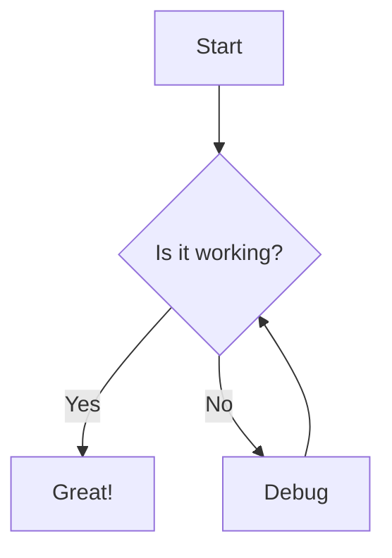
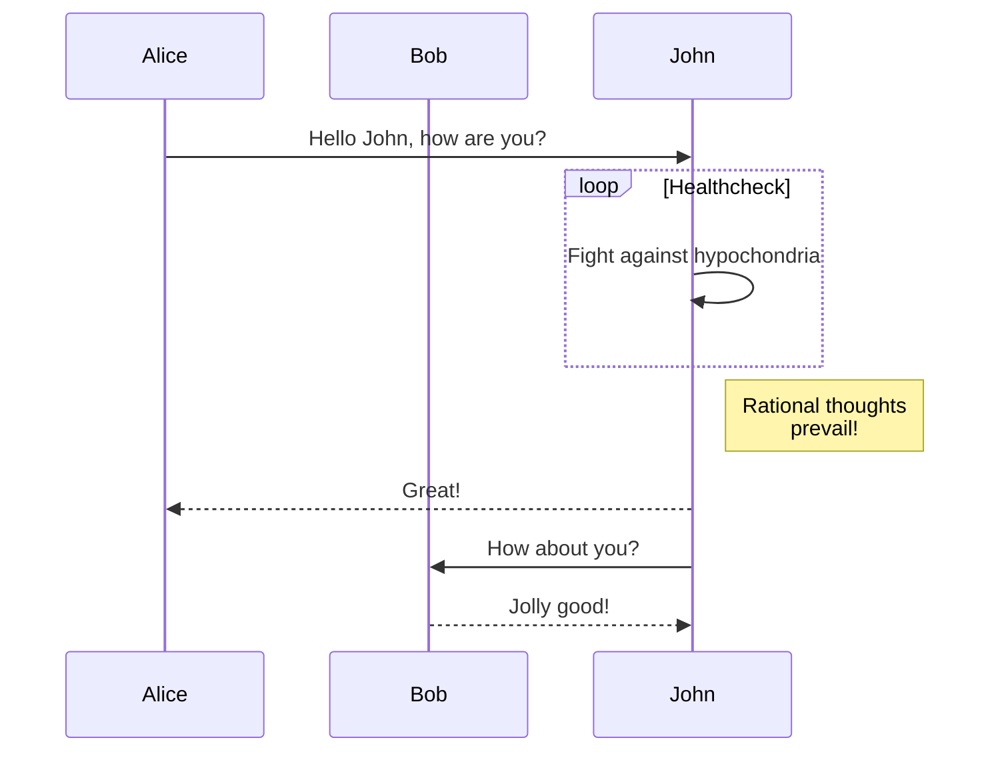
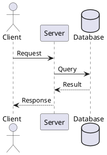

# Sample Content with Various Content Types

This document demonstrates the various content types supported by the Markdown to PDF converter.

## GitHub Flavored Markdown

### Lists

- Item 1
- Item 2
  - Nested item 1
  - Nested item 2
- Item 3

### Tables

| Name | Age | Occupation |
|------|-----|------------|
| John | 30  | Developer  |
| Jane | 25  | Designer   |
| Bob  | 35  | Manager    |

### Task Lists

- [x] Completed task
- [ ] Incomplete task
- [ ] Another incomplete task

## Mermaid Diagrams





## Mathematical Notation

Inline math: $E = mc^2$

Display math:

$$
\frac{d}{dx}\left( \int_{0}^{x} f(u)\,du\right)=f(x)
$$

## SVG Content

<svg width="100" height="100">
  <circle cx="50" cy="50" r="40" stroke="green" stroke-width="4" fill="yellow" />
</svg>

## Code Blocks with Syntax Highlighting

```python
def hello_world():
    print("Hello, world!")
    
if __name__ == "__main__":
    hello_world()
```

```javascript
function helloWorld() {
    console.log("Hello, world!");
}

helloWorld();
```

## HTML5 Media

### Video

<video width="320" height="240" controls>
  <source src="movie.mp4" type="video/mp4">
  Your browser does not support the video tag.
</video>

### Audio

<audio controls>
  <source src="audio.mp3" type="audio/mpeg">
  Your browser does not support the audio element.
</audio>

## Interactive Visualizations

### Plotly

```plotly
{
  "data": [
    {
      "x": [1, 2, 3, 4],
      "y": [10, 15, 13, 17],
      "type": "scatter"
    },
    {
      "x": [1, 2, 3, 4],
      "y": [16, 5, 11, 9],
      "type": "scatter"
    }
  ],
  "layout": {
    "title": "Plotly Example"
  }
}
```

### Chart.js

```chartjs
{
  "type": "bar",
  "data": {
    "labels": ["Red", "Blue", "Yellow", "Green", "Purple", "Orange"],
    "datasets": [{
      "label": "# of Votes",
      "data": [12, 19, 3, 5, 2, 3],
      "backgroundColor": [
        "rgba(255, 99, 132, 0.2)",
        "rgba(54, 162, 235, 0.2)",
        "rgba(255, 206, 86, 0.2)",
        "rgba(75, 192, 192, 0.2)",
        "rgba(153, 102, 255, 0.2)",
        "rgba(255, 159, 64, 0.2)"
      ],
      "borderColor": [
        "rgba(255, 99, 132, 1)",
        "rgba(54, 162, 235, 1)",
        "rgba(255, 206, 86, 1)",
        "rgba(75, 192, 192, 1)",
        "rgba(153, 102, 255, 1)",
        "rgba(255, 159, 64, 1)"
      ],
      "borderWidth": 1
    }]
  },
  "options": {
    "scales": {
      "y": {
        "beginAtZero": true
      }
    }
  }
}
```

## PlantUML (Plugin Example)



## External Content via iframes

<iframe width="560" height="315" src="https://www.youtube.com/embed/dQw4w9WgXcQ" frameborder="0" allow="accelerometer; autoplay; clipboard-write; encrypted-media; gyroscope; picture-in-picture" allowfullscreen></iframe>
