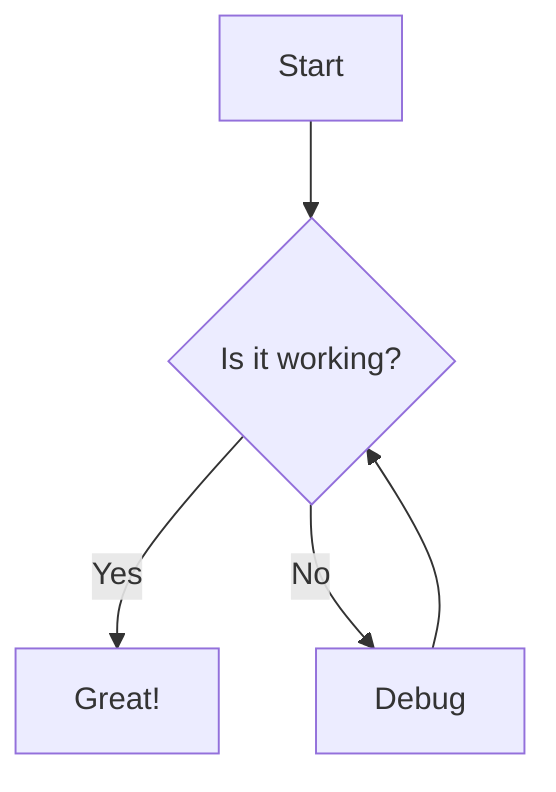

# Advanced Markdown Test

This is an advanced markdown file for testing.

## Math Equations

Inline math: $E = mc^2$

Block math:

$$
\frac{d}{dx}(x^n) = nx^{n-1}
$$

## Mermaid Diagram

## Page Break

## New Page

This content should appear on a new page.

## SVG Embedding

<svg width="100" height="100">
  <circle cx="50" cy="50" r="40" stroke="black" stroke-width="3" fill="red" />
</svg>

## HTML Table

<table>
  <tr>
    <th>Header 1</th>
    <th>Header 2</th>
  </tr>
  <tr>
    <td>Cell 1</td>
    <td>Cell 2</td>
  </tr>
</table>

## Footnotes

This is a sentence with a footnote[^1].

[^1]: This is the footnote content.
