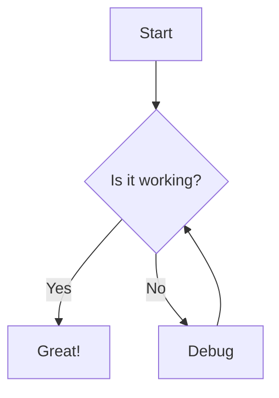

# Combined Features Test

This document tests a combination of features.

## Markdown Features

### Basic Formatting

**Bold text** and *italic text* and ~~strikethrough~~.

### Lists

1. First item
2. Second item
   - Nested item 1
   - Nested item 2
3. Third item

### Code

Inline `code` and code blocks:

```python
def factorial(n):
    if n <= 1:
        return 1
    return n * factorial(n-1)
```

<div style="page-break-before: always;"></div>

## Mermaid Diagram



## LaTeX Math

Inline math: $E = mc^2$

Block math:

$$\int_0^\infty \frac{x^3}{e^x-1}\,dx = \frac{\pi^4}{15}$$

<div style="page-break-before: always;"></div>

## SVG Embedding

<svg width="150" height="100">
  <rect width="150" height="100" fill="#f0f0f0" stroke="black" stroke-width="2" />
  <circle cx="50" cy="50" r="40" stroke="black" stroke-width="2" fill="red" />
  <text x="100" y="50" text-anchor="middle" font-family="Arial" font-size="16">SVG</text>
</svg>

## Table

| Feature | Supported | Notes |
|---------|-----------|-------|
| Markdown | Yes | GitHub Flavored |
| Mermaid | Yes | Diagrams |
| LaTeX | Yes | Math equations |
| SVG | Yes | Vector graphics |
| Page Breaks | Yes | For multi-page documents |
