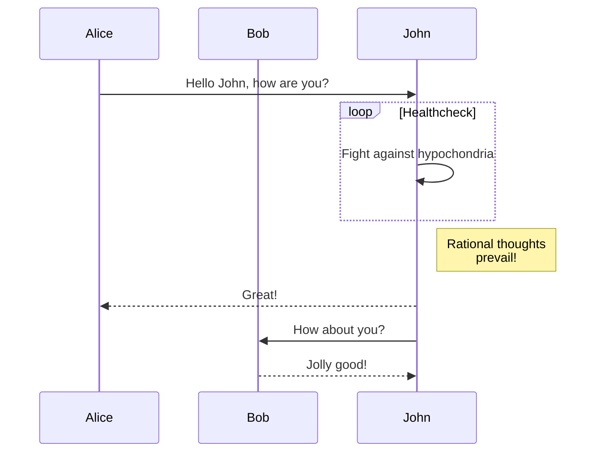

# Complex Document with Multiple Features

This document tests multiple features together.

## Table of Contents

<!-- TOC will be generated here -->

## Section 1: Text Formatting

This paragraph has **bold**, *italic*, and `code` formatting.

This is a [link to Google](https://www.google.com).

## Section 2: Lists

### Unordered Lists

- Item 1
- Item 2
  - Nested item 2.1
  - Nested item 2.2
- Item 3

### Ordered Lists

1. First item
2. Second item
   1. Nested item 2.1
   2. Nested item 2.2
3. Third item

## Section 3: Code Blocks

```python
def factorial(n):
    if n == 0 or n == 1:
        return 1
    else:
        return n * factorial(n-1)

# Calculate factorial of 5
result = factorial(5)
print(f"Factorial of 5 is {result}")
```

## Section 4: Tables

| Name     | Age | Occupation    |
|----------|-----|---------------|
| John Doe | 30  | Developer     |
| Jane Doe | 28  | Designer      |
| Bob Smith| 45  | Project Manager |

## Section 5: Blockquotes

> This is a blockquote.
> 
> It can span multiple lines.
>
> > This is a nested blockquote.

## Section 6: Math

Inline math: $E = mc^2$

Display math:

$$
\begin{align}
\nabla \times \vec{\mathbf{B}} -\, \frac1c\, \frac{\partial\vec{\mathbf{E}}}{\partial t} & = \frac{4\pi}{c}\vec{\mathbf{j}} \\
\nabla \cdot \vec{\mathbf{E}} & = 4 \pi \rho \\
\nabla \times \vec{\mathbf{E}}\, +\, \frac1c\, \frac{\partial\vec{\mathbf{B}}}{\partial t} & = \vec{\mathbf{0}} \\
\nabla \cdot \vec{\mathbf{B}} & = 0
\end{align}
$$

## Section 7: Diagrams



<div style="page-break-after: always;"></div>

## Section 8: Images


## Section 9: Definition Lists

Term 1
: Definition 1

Term 2
: Definition 2a
: Definition 2b

## Section 10: Footnotes

Here is a sentence with a footnote[^1].

[^1]: This is the footnote content.

## Section 11: Task Lists

- [x] Completed task
- [ ] Incomplete task
- [x] Another completed task

## Section 12: HTML Elements

<div style="color: blue; border: 1px solid black; padding: 10px;">
  <h3>Custom HTML Block</h3>
  <p>This is a custom HTML block with styling.</p>
</div>

## Section 13: Abbreviations

The HTML specification is maintained by the W3C.

*[HTML]: Hyper Text Markup Language
*[W3C]: World Wide Web Consortium
