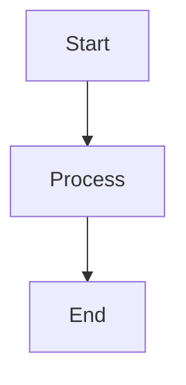

# Test Markdown File

This is a test markdown file to verify that the application works correctly.

## Section 1

This is section 1 of the test markdown file.

## Section 2

This is section 2 of the test markdown file.

### Subsection 2.1

This is subsection 2.1 of the test markdown file.

## Section 3

This is section 3 of the test markdown file.

## Section 4

This is section 4 of the test markdown file.

$$
E = mc^2
$$

## Section 5

This is section 5 of the test markdown file.

| Column 1 | Column 2 | Column 3 |
|----------|----------|----------|
| Row 1    | Data     | Data     |
| Row 2    | Data     | Data     |
| Row 3    | Data     | Data     |
